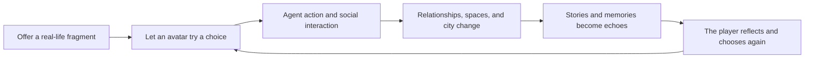
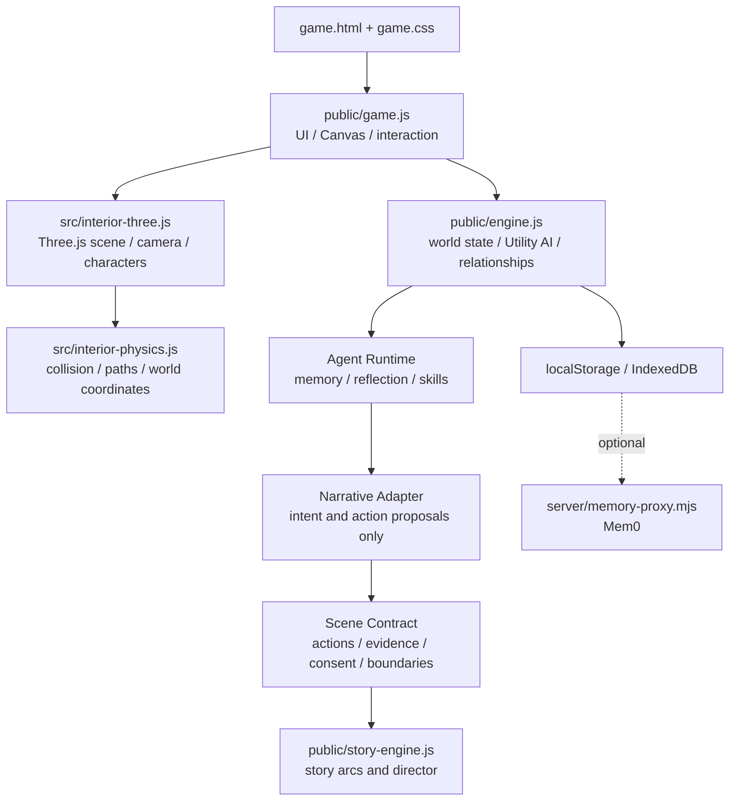

<div align="center">

# MirrorLife · 镜像人生

### What kind of life do you want to live?

A local-first narrative game about trying on lives, relationship echoes, and a society that keeps moving.

[中文](README.md) · [Quick Start](#quick-start) · [What You Can Play](#what-you-can-play) · [Architecture](#architecture) · [Documentation](#documentation)

[](https://github.com/plaxkk/MirrorLife/actions/workflows/ci.yml)


[](LICENSE)

</div>


<div align="center">
  <sub>Give a choice to your avatar, let people, relationships, and places live on, then return with the world's echo.</sub>
</div>

---

## What is MirrorLife?

MirrorLife is a **life-trial and social simulation game**. Players place a relationship, pressure, wish, or life choice into a mirrored community. Citizen Agents—with personalities, needs, emotions, relationships, and memories—continue to act, while the city responds through stories, relationship events, and spatial change.

It is neither a collection of prewritten branches nor a chat window wearing a game skin. Character behavior emerges from local Utility AI, psychological state, and social rules. Stories must cite real action evidence, and the rules engine remains the final authority over world state.

> Alive like a world. Playable like a game. Reflective like a mirror.



### Current release

| Dimension | Status |
| --- | --- |
| Product | Local-first, single-player playable development build |
| World | 20 fixed places, 30+ citizen behaviors, evolving community state |
| Interiors | True Three.js 3D, character follow, WASD movement, 360° orbit, and collision |
| Narrative | Local story director, action evidence, five-building episodes, and relationship aftermath |
| Saves | Hot state in localStorage, multi-slot IndexedDB saves, JSON import/export |
| Online services | No account or external AI API required; cloud memory proxy is optional and experimental |

## What You Can Play

A complete session can look like this:

1. Create a social avatar with personality tendencies, values, and relationship preferences.
2. Open an anonymous life capsule and make a pivotal choice for another possible life.
3. Watch the city, citizen relationships, and avatar state respond.
4. Follow characters through the community and explore buildings in true 3D.
5. Complete an embodied five-building arc: see, stay, cross, correct, and authorize.
6. Review the evidence left behind in the story log, weekly journal, and echo archive.
7. Use the local asynchronous Mirror Relay to invite a friend's one-time avatar into the next episode.

### Feature highlights

| System | Experience |
| --- | --- |
| Life trials | Life capsules, pivotal choices, city responses, robot signals, and unfinished echoes |
| Social avatars | 16 narrative archetypes mapped to Big Five, needs, PAD emotion, and values |
| Citizen life | 30+ rule-driven behaviors including commuting, talking, resting, and working |
| Relationships and memory | Trust, closeness, reciprocity, disclosure, power balance, and traceable evidence |
| Embodied episodes | Quiet presence, testimony parallax, empathy calibration, memory consent, and living aftermath |
| Story director | Raises dramatic questions from social state; Scene Contracts constrain action and authority |
| Mirror Relay | Mutual consent, four-act co-play, one-time guest avatars, and revocable sharing |
| Evolving community | Unlocks curated places and roles in response to social gaps |

## Gallery

<table>
  <tr>
    <td width="66%">
      
      <br />
      <sub>Desktop: movable, rotatable 3D interiors with character following</sub>
    </td>
    <td width="34%">
      <div align="center">
        
        <br />
        <sub>Mobile: touch joystick and responsive HUD</sub>
      </div>
    </td>
  </tr>
</table>

<table>
  <tr>
    <td width="50%"></td>
    <td width="50%"></td>
  </tr>
  <tr>
    <td><sub>A friend's avatar joins through real Agent action evidence</sub></td>
    <td><sub>The 16th evidence item creates a shared ending and the next relay</sub></td>
  </tr>
</table>

## Controls

### Open community

- Drag to pan across the city; use the wheel or touch gestures to zoom.
- Select a citizen to inspect their state, relationships, and recent actions, or follow their view.
- Select a building to enter; pause, step, change speed, or open saves from the top controls.

### 3D interiors

- Move with `WASD` / arrow keys; use the on-screen joystick on mobile.
- Drag the scene or use the orbit compass to rotate the camera.
- Approach people, furniture, and story hotspots to use contextual actions.
- Press `Esc` or choose “Back to street” to leave.

## Quick Start

### Requirements

- Node.js 22, matching CI
- npm 10+
- A modern Chrome / Chromium browser with WebGL

### Run locally

```bash
git clone https://github.com/plaxkk/MirrorLife.git
cd MirrorLife
npm ci
npm run dev
```

Open <http://localhost:4173/game.html>.

Production build:

```bash
npm run check
npm run build
npm run preview
```

The default build needs no environment variables, account, or LLM API key.

<details>
<summary><strong>Optional: connect the cloud memory proxy</strong></summary>

Production secrets must remain server-side:

```bash
VOLC_MEM0_BASE_URL=<project-endpoint> \
VOLC_MEM0_API_KEY=<api-key> \
npm run memory-proxy
```

Then enter this endpoint in the in-game Saves & Memory panel:

```text
http://localhost:8787/api/memory
```

If the proxy is unavailable, memory automatically falls back to local IndexedDB.

</details>

## Architecture

MirrorLife uses a browser-based local-first architecture. Canvas renders the open community and UI, Three.js renders 3D interiors, and the rules engine owns final state. Agents and narrative systems can influence the world only through controlled proposals and action evidence.



### Engineering principles

- **Rules before models:** an LLM adapter cannot directly mutate relationships, memory, or city metrics.
- **Actions before dialogue:** story progress must cite real Agent `outbox` evidence.
- **One spatial language:** people, furniture, interaction distances, and camera use the same X/Z coordinates.
- **Privacy by default:** real-life fragments and memories must be consented, revocable, and deletable.
- **Development assets are not release assets:** 3D runtime and art-release quality have separate gates.

<details>
<summary><strong>Repository map</strong></summary>

```text
.
├── game.html                   # Main game page
├── game.css                    # HUD, panels, mobile, and interior UI
├── public/
│   ├── engine.js               # Social simulation, Agent runtime, relationships
│   ├── game.js                 # Canvas rendering, interaction, interior orchestration
│   ├── story-engine.js         # Evolving story arcs and story director
│   ├── storage.js              # IndexedDB multi-slot saves
│   └── assets/                 # Sprites, GLBs, textures, and references
├── src/
│   ├── interior-three.js       # Three.js scenes, models, camera, and projection
│   └── interior-physics.js     # Collision, walkable regions, and paths
├── server/memory-proxy.mjs     # Optional Mem0 server proxy
├── scripts/                    # Build, verification, capture, and 3D pipelines
└── docs/                       # Product, gameplay, architecture, and quality docs
```

</details>

## Verification and Quality Gates

Core regression:

```bash
npm run check
npm run test:evolution
npm run build
npm run verify:interior-physics
git diff --check
```

The 3D interior has dedicated physics, character exploration, scene flow, transition stress, visual fidelity, and performance checks:

```bash
npm run verify:interior-character-exploration
npm run verify:interior-scene-flow
npm run verify:interior-transitions
npm run verify:characters:civic
npm run verify:reference-fidelity:v3
npm run benchmark:interior
```

Production 3D assets use stricter independent release gates. See the [3D Interior Fidelity Standard](docs/INTERIOR_3D_FIDELITY.md).

## Current Boundaries

This repository is a playable development build, not a launched online AI society:

- There is no account system, real multi-user community, or cloud world state.
- No production LLM provider is enabled; production secrets must never be placed in the browser.
- Message drifting and life exchange are local anonymous simulations, not real-user matching.
- Runtime 3D assets are still in development and have not all passed the final art-release gate.
- MirrorLife is a game and narrative experiment, not psychotherapy, diagnosis, or crisis support.

## Roadmap

- **P0 · Single-player loop:** stronger intervention, replayable crises, cross-building stories, return summaries, and release-quality 3D assets.
- **P1 · Multi-Agent society:** server orchestration, production LLMs, layered memory, audits, and explainable replay.
- **P2 · Consent-based weak ties:** accounts and cloud saves, signed relays, anonymization, moderation, and deletion.
- **P3 · A growing world:** connected districts, public construction, long-term institutions, and reviewed user creations.

The roadmap communicates direction, not dates. Priorities are driven by whether the game becomes more playable, understandable, and worth returning to.

## Documentation

- [Product design](PRODUCT_DESIGN.md) · Chinese
- [Agent runtime plan](AGENT_RUNTIME_PLAN.md) · Chinese
- [Scene Contracts and independent model boundaries](docs/SCENE_CONTRACTS.md) · Chinese
- [Gameplay design](docs/GAMEPLAY_FUN_DESIGN.md) · Chinese
- [Life-experience roadmap](docs/LIFE_EXPERIENCE_GAMEPLAY_ROADMAP.md) · Chinese
- [Psychology framework](docs/PSYCHOLOGY_FRAMEWORK.md) · Chinese
- [3D interior model pipeline](docs/INTERIOR_3D_MODEL_PIPELINE.md) · Chinese
- [Release checklist](docs/RELEASE_CHECKLIST.md) · English

## Contributing

Issues and pull requests are welcome. Before submitting:

1. Follow the principles of game before dashboards, actions before dialogue, and rules before models.
2. Never commit production API keys, real user data, or unsanitized research material.
3. Pass at least `npm run check`, `npm run build`, and the checks relevant to your change.

## License

[MIT](LICENSE) © MirrorLife contributors
