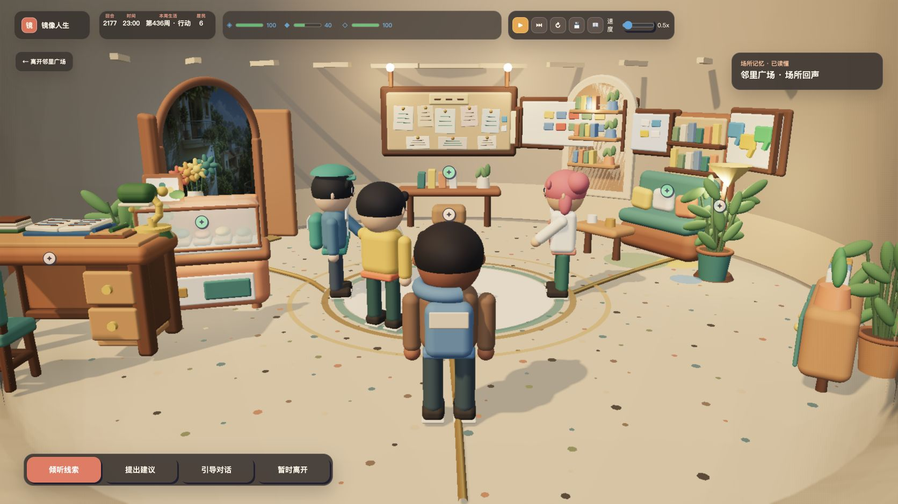
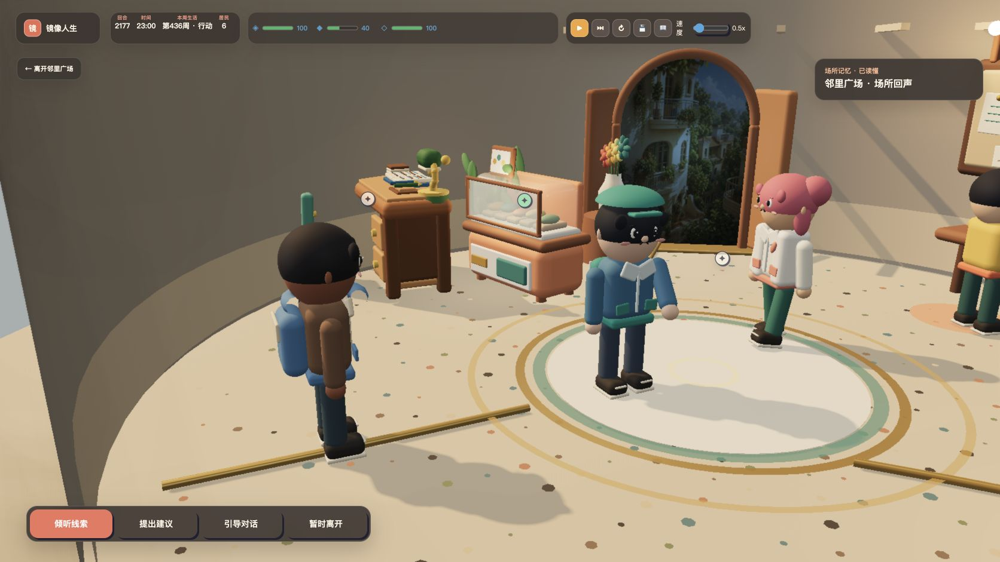
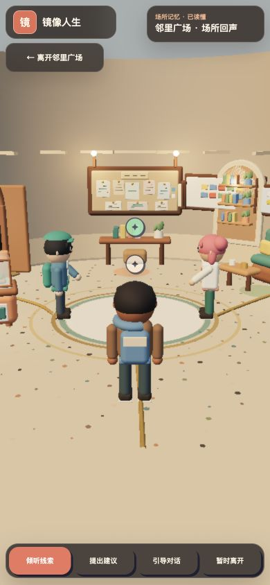
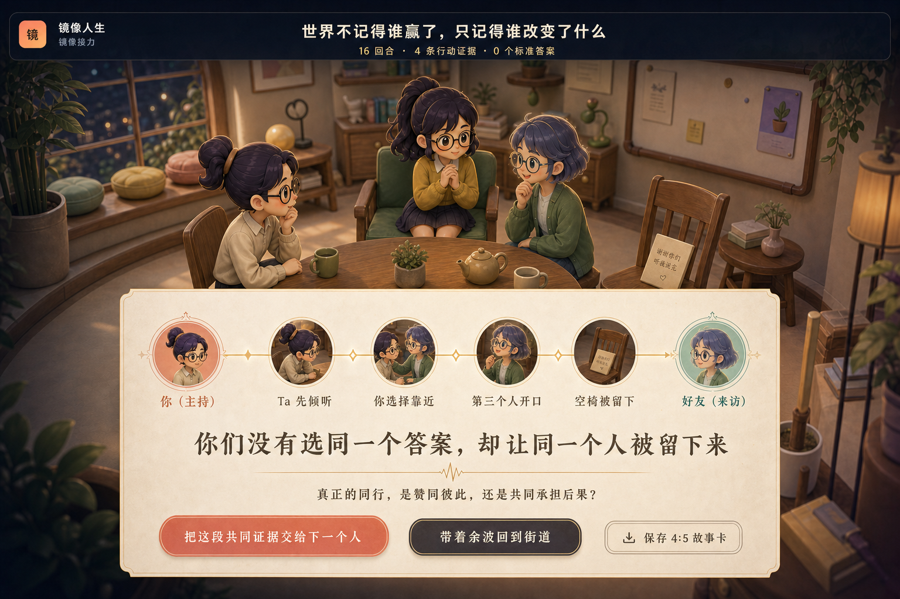
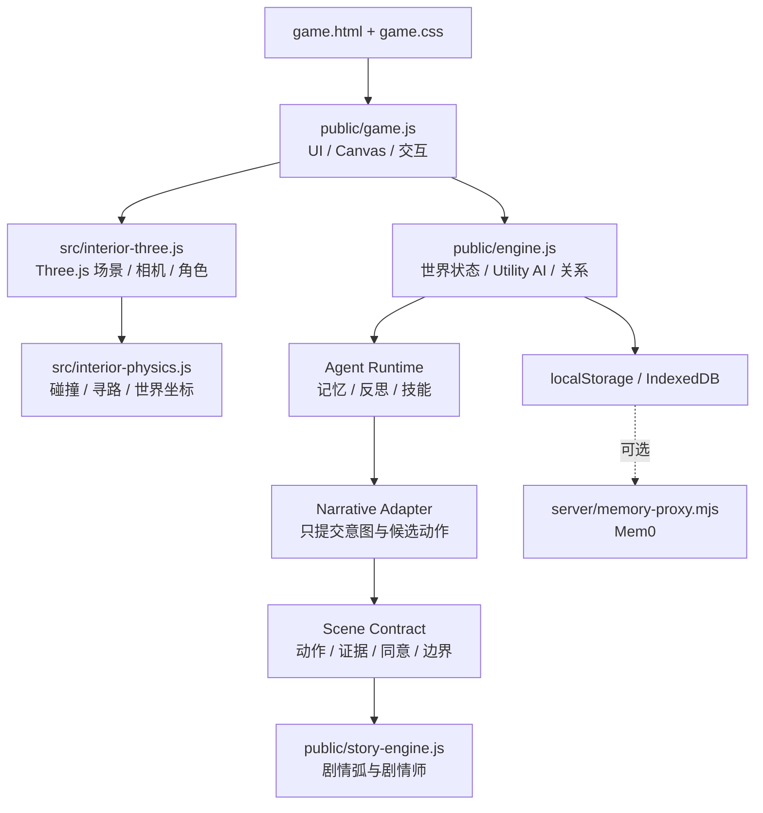

<div align="center">

# 镜像人生 · MirrorLife

### 你想活出怎样的人生？

一款关于人生试活、关系回声与持续社会模拟的 local-first 叙事游戏。

[English](README.en.md) · [快速开始](#快速开始) · [现在能玩什么](#现在能玩什么) · [技术架构](#技术架构) · [项目文档](#项目文档)

[](https://github.com/plaxkk/MirrorLife/actions/workflows/ci.yml)


[](LICENSE)

</div>



<div align="center">
  <sub>把现实中的选择交给分身，让人物、关系与空间继续生活，然后带着世界的回声回到自己。</sub>
</div>

---

## MirrorLife 是什么

MirrorLife 是一款“**人生试活 + 社会模拟**”游戏。玩家把一段关系、压力、愿望或人生选择投进镜像社区；拥有性格、需求、情绪、关系和记忆的 Citizen Agents 会继续行动，城市则用剧情、关系事件和空间变化作出回应。

它不是一组预先写好的分支，也不是一个套着游戏外壳的聊天窗口。角色的行动由本地 Utility AI、心理状态与社会规则共同驱动，剧情必须引用真实行动证据，世界状态最终由规则引擎裁决。

> 像世界一样活着，像游戏一样可玩，像镜子一样照见人。


### 当前版本

| 维度 | 状态 |
| --- | --- |
| 产品形态 | local-first 单人可玩开发版 |
| 世界 | 20 个固定场所、30+ 种市民行为、可演化社区状态 |
| 室内 | Three.js 真实 3D、人物跟随、WASD 移动、360° 环视与碰撞 |
| 叙事 | 本地 AI 剧情师、行动证据、五建筑章节与关系余波 |
| 存档 | localStorage 热状态、IndexedDB 多槽存档、JSON 导入导出 |
| 在线能力 | 默认无需账号或外部 AI API；云端记忆代理为可选实验能力 |

## 现在能玩什么

一次完整体验可以是：

1. 创建一个带人格倾向、价值观与关系偏好的社会分身。
2. 打开匿名人生胶囊，替另一种人生作出一次关键选择。
3. 观察城市、市民关系和分身状态如何回应。
4. 跟随人物在社区行动，进入建筑并以真实 3D 视角探索。
5. 沿五栋建筑完成“看见 → 留下 → 穿过 → 修正 → 授权”的具身叙事。
6. 在剧情志、人生周记和回声档案中回看行动留下的证据。
7. 通过本地异步的“镜像接力”，邀请朋友的一次性分身进入下一集。

### 特色系统

| 系统 | 体验 |
| --- | --- |
| 人生试活 | 人生胶囊、关键选择、城市回应、机器人信号与未完回声 |
| 社会分身 | 16 型叙事人格映射到 Big Five、需求、PAD 情绪与价值观 |
| 市民生活 | 通勤、交谈、休息、工作、进出建筑等 30+ 种规则驱动行为 |
| 关系与记忆 | 信任、亲近、互惠、披露、权力平衡与可追溯互动证据 |
| 具身章节 | 静默陪伴、证词视差、误解校准、记忆授权和活体余波 |
| AI 剧情师 | 从社会状态提出戏剧问题，用 Scene Contract 限定动作与权限 |
| 镜像接力 | 双向同意、四幕共演、一次性访客分身与可撤回的分享链路 |
| 自演化社区 | 根据社会缺口，从预设蓝图中解锁新场景与职业 |

## 游戏画面

<table>
  <tr>
    <td width="66%">
      
      <br />
      <sub>桌面端：可移动、可旋转、可跟随人物的 3D 室内</sub>
    </td>
    <td width="34%">
      <div align="center">
        
        <br />
        <sub>移动端：触控方向盘与自适应 HUD</sub>
      </div>
    </td>
  </tr>
</table>

<table>
  <tr>
    <td width="50%"></td>
    <td width="50%"></td>
  </tr>
  <tr>
    <td><sub>朋友分身基于真实 Agent 行动证据参与共演</sub></td>
    <td><sub>第 16 条证据生成共同结局与下一棒</sub></td>
  </tr>
</table>

## 操作方式

### 开放社区

- 拖动地图观察城市，使用滚轮或触控缩放。
- 点击市民查看状态、关系与最近行动，或跟随 TA 的视角。
- 点击建筑进入室内；顶部控制区可暂停、单步推进、调整速度和打开存档。

### 3D 室内

- `WASD` / 方向键移动；移动端使用屏幕方向盘。
- 拖动场景或使用环绕罗盘旋转视角。
- 靠近人物、家具与剧情热点后使用场景动作。
- `Esc` 或“回到街道”离开室内。

## 快速开始

### 环境要求

- Node.js 22（与 CI 一致）
- npm 10+
- 支持 WebGL 的现代 Chrome / Chromium

### 本地运行

```bash
git clone https://github.com/plaxkk/MirrorLife.git
cd MirrorLife
npm ci
npm run dev
```

浏览器打开 <http://localhost:4173/game.html>。

生产构建：

```bash
npm run check
npm run build
npm run preview
```

默认运行不需要环境变量、账号或 LLM API key。

<details>
<summary><strong>可选：连接云端记忆代理</strong></summary>

生产密钥只能保存在服务端：

```bash
VOLC_MEM0_BASE_URL=<项目连接地址> \
VOLC_MEM0_API_KEY=<API Key> \
npm run memory-proxy
```

然后在游戏的“存档与记忆”面板填入：

```text
http://localhost:8787/api/memory
```

代理不可用时，系统自动降级到本地 IndexedDB。

</details>

## 技术架构

MirrorLife 采用浏览器 local-first 架构：Canvas 承载开放社区与 UI，Three.js 承载 3D 室内，规则引擎拥有最终状态；Agent 和叙事层只能通过受控提案与行动证据影响世界。



### 核心工程原则

- **规则先于模型**：LLM adapter 不能直接修改关系、记忆或城市指标。
- **行动先于台词**：剧情推进必须引用真实 Agent `outbox` 证据。
- **统一空间语义**：人物、家具、交互距离与相机共享 X/Z 世界坐标。
- **隐私默认收紧**：现实片段与记忆必须可授权、可撤回、可删除。
- **开发资产不冒充正式资产**：3D 模型有独立的运行时与发布质量门禁。

<details>
<summary><strong>项目目录</strong></summary>

```text
.
├── game.html                   # 主游戏页面
├── game.css                    # HUD、面板、移动端与室内 UI
├── public/
│   ├── engine.js               # 社会模拟、Agent runtime 与关系系统
│   ├── game.js                 # Canvas 渲染、交互与室内编排
│   ├── story-engine.js         # 自演化剧情弧与 AI 剧情师
│   ├── storage.js              # IndexedDB 多槽存档
│   └── assets/                 # 精灵图、GLB、纹理与参考资产
├── src/
│   ├── interior-three.js       # Three.js 场景、模型、相机与投影
│   └── interior-physics.js     # 碰撞、可行走区域与路径
├── server/memory-proxy.mjs     # 可选 Mem0 服务端代理
├── scripts/                    # 构建、验证、截图与 3D 资产管线
└── docs/                       # 产品、玩法、架构与质量文档
```

</details>

## 验证与质量门禁

基础回归：

```bash
npm run check
npm run test:evolution
npm run build
npm run verify:interior-physics
git diff --check
```

3D 室内还提供物理、人物探索、场景流、连续切换、视觉保真和性能基准脚本：

```bash
npm run verify:interior-character-exploration
npm run verify:interior-scene-flow
npm run verify:interior-transitions
npm run verify:characters:civic
npm run verify:reference-fidelity:v3
npm run benchmark:interior
```

正式 3D 资产使用更严格的独立发布门禁，详见 [室内 3D 高保真规范](docs/INTERIOR_3D_FIDELITY.md)。

## 当前边界

当前仓库是可玩的开发版本，不应被描述为已经上线的在线 AI 社会：

- 没有账号体系、真实多用户社区或云端世界状态。
- 没有启用生产 LLM provider；浏览器端不得放置生产密钥。
- 漂流瓶和交换人生仍是本地匿名模拟，不是真实用户匹配。
- 3D 运行时资产仍在开发，尚未全部通过正式美术发布门禁。
- MirrorLife 是游戏与叙事实验，不提供心理治疗、诊断或危机干预。

## 路线图

- **P0 · 单人闭环**：更强的主动介入、可重玩危机、跨建筑剧情、回访摘要与正式 3D 资产。
- **P1 · 多 Agent 社会**：服务端世界调度、生产 LLM、分层记忆、审计与可解释回放。
- **P2 · 同意式弱连接**：账号与云存档、签名接力、匿名化、举报屏蔽与数据删除。
- **P3 · 持续生长的世界**：多街区、公共建设、长期制度与可审核的用户创作。

路线图表达方向，不承诺日期。优先级始终由“是否更好玩、更清楚、更值得回来”决定。

## 项目文档

- [产品设计方案](PRODUCT_DESIGN.md)
- [Agent 运行时规划](AGENT_RUNTIME_PLAN.md)
- [Scene Contract 与独立模型边界](docs/SCENE_CONTRACTS.md)
- [玩法趣味设计](docs/GAMEPLAY_FUN_DESIGN.md)
- [人生体验路线图](docs/LIFE_EXPERIENCE_GAMEPLAY_ROADMAP.md)
- [心理连锁框架](docs/PSYCHOLOGY_FRAMEWORK.md)
- [室内 3D 模型管线](docs/INTERIOR_3D_MODEL_PIPELINE.md)
- [发布检查清单](docs/RELEASE_CHECKLIST.md)

## 参与贡献

欢迎通过 Issue 或 Pull Request 参与。提交前请确保：

1. 改动遵循“游戏先于面板、行动先于台词、规则先于模型”的原则。
2. 不提交生产 API key、真实用户数据或未脱敏材料。
3. 至少通过 `npm run check`、`npm run build` 与相关专项验证。

## License

[MIT](LICENSE) © MirrorLife contributors
