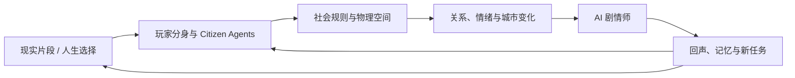
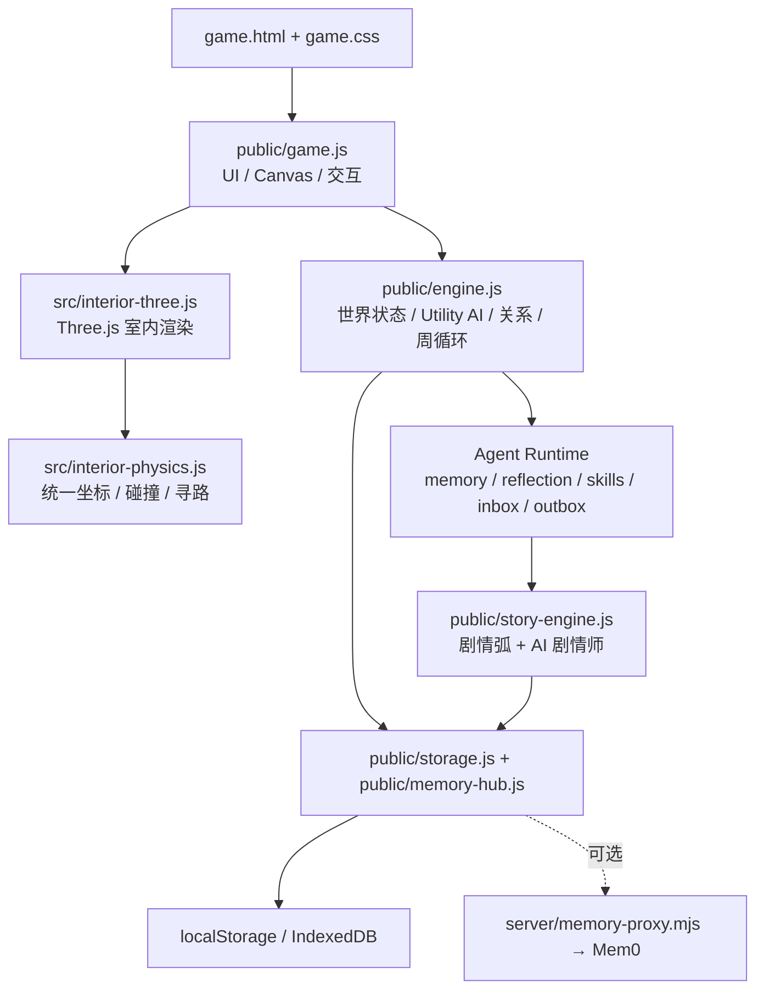

# 镜像人生（MirrorLife）

> 你想活出怎样的人生。

MirrorLife 是一款“人生试活 + 社会模拟”游戏。玩家把选择、关系和现实片段交给自己的分身，在一座持续运行的镜像社区里观察：人物如何生活、关系如何变化、空间如何回应、故事如何从真实行动中长出来。

它希望成为一个“像世界一样活着、像游戏一样可玩、像镜子一样照见人”的虚拟社会。

当前版本是 **local-first 的单人可玩开发版**：无需账号或外部 AI API 即可运行。在线多用户社会、生产级 LLM Agent、真实漂流匹配和正式 3D 美术资产仍在未来路线图中。

## 产品愿景

MirrorLife 的核心问题不是“我有没有赢”，而是：

> 当熟悉的身份不再足够定义我，我还想把自己带向哪里？

产品由四层世界组成：

1. **现实层**：玩家投放一段关系、压力、选择或生活愿望。
2. **分身层**：每个角色拥有性格、需求、情绪、价值观、关系和记忆。
3. **社会层**：分身在共同空间中行动，彼此影响并改变城市状态。
4. **回声层**：世界把行动结果写成剧情、关系事件、人生周记和下一次选择。



世界遵循四条社会原则：自由表达，也允许沉默；平等参与，不让强势角色垄断现场；保持开放，让现实片段能够改变世界；允许脆弱，让低状态角色仍然拥有行动权。

## 给玩家：现在可以玩什么

### 一次完整体验

第一次进入游戏时，你可以：

1. 创建一个带人格倾向的社会分身。
2. 进入匿名人生胶囊，替另一种人生做一次关键选择。
3. 看见城市、关系和分身状态如何回应。
4. 在开放社区中观察市民的日常生活，或跟随某个角色行动。
5. 进入建筑室内，以 360° 视角探索空间、人物和剧情热点。
6. 在剧情志中查看 AI 剧情师提出的戏剧问题，以及角色如何用真实行动改写任务。
7. 在一集结束后，把未解决的问题以「镜像接力」交给真实朋友；双方同意后，让朋友的一次性分身进入下一集。
8. 进入「四幕共演」观察朋友分身的真实行动；第 8 条证据决定靠近或留出空间，第 16 条证据生成可分享的共同结局，并把争议继续交给下一位真人。
9. 通过机器人信号、漂流回声、人生周记和回声档案回看这段经历。

核心循环：

```text
试活一种人生 → 做出选择 → 城市回应 → 分身继续生活
        ↑                               ↓
   回家复盘 ← 回声与记忆 ← 关系 / 剧情 / 空间变化
```

### 已实现能力

| 系统 | 玩家目前能体验到的内容 | 状态 |
| --- | --- | --- |
| 人生试活 | 人生胶囊、关键选择、城市回应、机器人信号、漂流瓶入口、未完回声 | 可玩 |
| 分身创建 | 16 型人格叙事卡、价值观、爱好和形象选择；底层映射到 Big Five、需求、PAD 情绪与关系偏好 | 可玩 |
| 开放社区 | 20 个固定场所，按公共、生活、医疗、教育、商业、工作、生态和记忆功能组织 | 可玩 |
| 社会自演化 | 根据社会缺口，从 6 个蓝图中解锁新场景与新职业；目前是规则驱动，不是任意生成建筑 | 可玩 |
| 市民生活 | 30 余种生活、社交、工作和情绪行为；人物会通勤、交谈、休息、工作、进出建筑 | 可玩 |
| 关系系统 | 熟悉度、信任、亲近、互惠、披露深度、权力平衡和张力；每次互动保留事件证据 | 可玩 |
| 心理连锁 | 现实事件经过认知评估，形成应对行为、场所寻求、社会互动和情绪涟漪 | 可玩 |
| 本周生活 | `准备 → 联系 → 行动 → 回看 → 沉淀` 的长期节律，以及同频度、满足感、稳定感回声 | 可玩 |
| 3D 室内 | 真实透视相机、360° 环视、统一 X/Z 世界坐标、人物/家具碰撞、热点与室内活动 | 开发版可玩 |
| 30 分钟双线回声 | 五个真实建筑组成一集；每个房间探索证物、比较“事实/如果”并承担后果，余波路线在街道持续标记下一章，终章汇总不同 Agent 的记忆 | 垂直切片可玩 |
| 体验指纹 | 本机记录活跃探索、首次发现、选择停留、章节完成与分享动作；终章显示个人节奏，并可主动导出不含昵称和自由文本的匿名试玩证据 | 可验证 |
| AI 剧情师 | 观察社会状态、生成戏剧任务、给不同分身分配意图，并根据真实行动证据推进或偏航 | 第一版可玩 |
| 镜像接力 | 终章邀请链接、双向同意、访客 Agent 入场、16 条行动证据、四幕共演、玩家距离选择、第三人回应、4:5 结局卡、下一棒与安全撤回 | 本地异步版可玩 |
| 自演化剧情 | 关系裂痕、深交、城市张力、心理变化和生命事件会形成“起承转合”的剧情弧 | 可玩 |
| 记忆与存档 | localStorage 热状态、IndexedDB 多槽存档、自动存档、JSON 导入导出、本地记忆检索 | 可玩 |
| 云端记忆 | 可选通过后端代理接入火山引擎 Mem0；不配置时仍可完整游玩 | 可选实验能力 |
| 安全边界 | 高风险文本走本地保护路径；产品不做心理诊断或治疗承诺 | 已接入基础规则 |

### AI 剧情师如何工作

当前 AI 剧情师是**基于模拟状态和 Agent 记忆的本地剧情调度器**，不是浏览器直连大模型。

它会观察人物情绪、沉默、关系张力、城市压力和最近行动，从剧情原型中选择适合当前社会的问题，例如：

- 《那把一直空着的椅子》：倾听是邀请对方开口，还是允许对方保持沉默？
- 《把我的一天借给你》：理解另一个人，是体验他的辛苦，还是尊重他的选择？
- 《今晚全城只留一盏灯》：资源不足时，多数选择和脆弱者安全感如何取舍？
- 《一顿无法表决的晚饭》：当两个理由都成立时，关系能否创造第三种答案？

剧情师只提供角色意图，不遥控角色。分身可以遵循任务，也可以因为情绪、记忆或自身倾向拒绝建议；偏航同样会被记录为剧情事实。任务结果会写回角色记忆、反思和技能，成为下一轮社会演化的输入。

### 操作方式

开放社区：

- 拖动地图观察城市，使用滚轮或触控缩放。
- 点击市民查看状态、关系和最近行动，也可以跟随 TA 的视角。
- 点击建筑进入室内；顶部按钮可暂停、单步推进、调整速度、打开存档或剧情志。

室内探索：

- `WASD` / 方向键移动，移动端使用屏幕方向盘。
- 拖动场景或点击环绕罗盘旋转视角。
- 靠近家具和人物后使用场景动作；`Esc` 或“回到街道”离开。
- 相机以房间中心为主要旋转枢轴，并轻微跟随玩家位置，避免围绕门口偏转。

### 当前边界

以下能力**尚未完成**，不应把当前 demo 描述成已经上线的在线 AI 社会：

- 没有账号体系、真实多用户社区或云端世界状态。
- 每个真实用户尚未拥有一个持续在线、可互相访问的 AI 社会分身。
- 已能通过最小化链接完成一次性的好友分身接力，但还没有服务端身份认证、自动回传、过期签名或在线状态。
- 没有启用生产 LLM 编排；`public/narrative.js` 中的浏览器直连实验路径不得放入生产密钥。
- 漂流瓶和交换人生目前是本地匿名模拟，不是真实用户匹配。
- 3D 室内已具备完整物理与交互骨架，但运行时模型仍是开发资产，尚未全部通过正式美术发布门禁。
- 没有支付、订阅、排行榜、自由建造、完整经济或物品制作系统。
- MirrorLife 是游戏和叙事实验，不是心理治疗、诊断或危机干预服务。

## 接下来要建设什么

路线图描述产品方向，不代表承诺日期。优先级以“是否让游戏更好玩、更可理解、更值得回来”为准。

### P0：完成真正有回访动力的单人游戏闭环

- 让玩家能在剧情任务中主动选择介入、旁观、支持或改变规则，而不只是观察 Agent。
- 增加可重玩的社会危机场景、关系任务和跨建筑剧情链。
- 增加“离线期间发生了什么”摘要、夜间反思和未完成关系线索。
- 建设同频关系图谱、因果回放和更清楚的“为什么世界变成这样”。
- 把本周生活奖励进一步转化为场所开放、角色信任和行动权限，而不是抽象分数。
- 优化首分钟引导、移动端交互、性能预算和无障碍体验。
- 完成关键室内陈设的多视图高模、人工修模、Web LOD 和发布验收。

### P1：生产级多 Agent 社会

- 为每位用户建立一个长期社会分身，拥有可撤销的人格、边界、关系和记忆授权。
- 建设服务端世界调度器、Citizen Agent、规则审计 Agent、记忆整理 Agent 和剧情师 Agent。
- 接入生产 LLM 时，坚持“模型提出候选，规则引擎裁决状态”，避免模型直接篡改世界。
- 增加 Agent trace、成本预算、失败降级、离线评测、越界审计和人工可解释回放。
- 将短期/中期/长期记忆分层，并提供查看、导出、纠正、遗忘和删除能力。
- 让角色从成功经历中沉淀调停、照护、组织、创作和建设技能，而不是在线修改模型权重。

### P2：经过同意的真实弱连接

- Supabase 或等价账号与云端存档。
- 将现有镜像接力从手动回传链接升级为带签名、过期、一次性消费、删除审计的服务端双向接力。
- 真实人生胶囊的授权、匿名化、撤回和审计。
- 漂流瓶的延迟同频匹配，而不是即时聊天或社交 feed。
- “只交换回声 → 双方同意继续 → 可随时退出”的渐进式连接。
- 举报、屏蔽、内容审核、敏感数据隔离和用户数据删除流程。

### P3：持续生长的空间世界

- 从单个社区扩展到多个相连街区，并保持统一物理尺度、道路图和空间句法。
- 玩家参与公共空间建设、室内布置、资源协作和职业生态，而不仅是规则自动解锁。
- 更丰富的人生阶段、家庭与组织关系、公共制度、节日和长期社会事件。
- 用户创作的剧情原型、建筑语义和社区规则进入可审核的内容管线。
- 探索情感机器人作为现实与虚拟社会之间的低压力信使；硬件并非当前版本依赖。

## 给开发者：运行项目

### 环境要求

- Node.js 22（CI 使用版本）
- npm 10+
- 现代 Chromium / Chrome 浏览器，支持 WebGL

### 快速开始

```bash
npm ci
npm run dev
```

Vite 默认打开：

```text
http://localhost:4173/game.html
```

生产构建：

```bash
npm run check
npm run build
npm run preview
```

默认运行不需要环境变量，也不需要 LLM API key。

### 可选云端记忆代理

生产密钥只允许出现在服务端：

```bash
VOLC_MEM0_BASE_URL=<项目连接地址> \
VOLC_MEM0_API_KEY=<API Key> \
npm run memory-proxy
```

然后在游戏的 `💾 存档与记忆` 面板填入：

```text
http://localhost:8787/api/memory
```

未配置或代理不可用时，记忆系统自动降级到本地 IndexedDB。

## 技术架构

MirrorLife 当前采用浏览器本地优先架构：Canvas 负责开放社区与 UI，Three.js 负责室内 3D，规则引擎拥有最终状态，Agent 与剧情层只能通过受控动作改变世界。



### 状态推进原则

单个社会回合的大致顺序：

```text
世界观察 → Agent 读取记忆与任务 → Utility AI 选择行动
→ 规则引擎结算 → 关系/心理/空间状态更新
→ 剧情师读取行动证据 → 写入事件、反思、技能与存档
```

关键约束：

- `public/engine.js` 是世界状态的最终裁决者。
- Agent 任务是行动建议，不是跳过规则的状态写入权限。
- 剧情必须引用真实 `outbox` 行动证据；角色拒绝任务也属于有效分支。
- 室内人物、家具、交互距离和相机使用同一套 X/Z 世界坐标。
- Three.js 未准备完成前只显示原子化加载幕，不渲染另一套临时房间。
- 生产 API key 不进入浏览器，不把用户原始敏感文本默认共享给其他角色或用户。

### 主要目录

```text
.
├── game.html                         # 主游戏页面
├── game.css                          # HUD、面板、移动端与室内 UI
├── index.html                        # 入口页
├── public/
│   ├── engine.js                     # 社会模拟、Agent runtime、关系与本周生活
│   ├── game.js                       # Canvas 渲染、交互、人物动画与室内编排
│   ├── story-engine.js               # 自演化剧情弧与 AI 剧情师
│   ├── causal-graph.js               # 本地因果图记忆
│   ├── storage.js                    # IndexedDB 多槽存档
│   ├── memory-hub.js                 # 本地记忆与可选云端出站队列
│   ├── narrative.js                  # 模板叙事 fallback 与停用的实验路径
│   └── assets/                       # 精灵图、GLB、纹理与室内参考资产
├── src/
│   ├── interior-three.js             # Three.js 场景、模型、相机与投影
│   ├── interior-physics.js           # 室内静态/动态碰撞、可行走区域与路径
│   └── interior-semantic-models.js   # 语义匹配的程序化开发模型
├── server/
│   └── memory-proxy.mjs              # 可选 Mem0 服务端代理
├── config/                            # 室内模型映射与语义资产 brief
├── scripts/                           # 构建、验证、截图与 3D 资产管线
├── tools/                             # 室内模型与标准视图审查工具
├── PRODUCT_DESIGN.md                  # 产品愿景与系统设计
└── AGENT_RUNTIME_PLAN.md              # 多 Agent 运行时规划
```

## 验证与质量门禁

基础回归：

```bash
npm run check
npm run test:evolution
npm run build
npm run verify:interior-physics
git diff --check
```

室内端到端流程需要先启动本地服务：

```bash
# Terminal A
npm run dev -- --host 127.0.0.1

# Terminal B
MIRRORLIFE_BASE_URL=http://127.0.0.1:4173 npm run verify:interior-scene-flow
MIRRORLIFE_BASE_URL=http://127.0.0.1:4173 npm run verify:mirror-relay
MIRRORLIFE_BASE_URL=http://127.0.0.1:4173 npm run verify:episode-trail
MIRRORLIFE_BASE_URL=http://127.0.0.1:4173 npm run verify:episode-experience
```

这条流程会在桌面和移动端验证：

- 室内只经过 `loading → ready`，不会先渲染旧房间再切换。
- 相机枢轴以房间中心为主，不围绕门口玩家错误旋转。
- 选择会更新本周奖励和关系事件。
- AI 剧情师能创建任务、读取 Agent 行动证据、形成结局，并在室内剧情志中可见。
- 镜像接力能跨两个隔离身份完成双重同意、回应回流、访客 Agent 入场与撤回，且好友端不落长期档案。
- 镜像接力四幕共演能从真实 Agent outbox 累计 16 条证据，分别跑通 `join` 与 `space`，生成 1080 × 1350 故事卡和可继续游玩的下一棒链接。
- 一章结束后能回到同一物理街道，五节点余波路线读取真实 `scenePlayed` 进度、聚焦下一建筑，且不会自动完成或传送玩家。

3D 开发运行时与正式发布资产是两套门禁：

```bash
npm run verify:interior-world
npm run verify:interior-3d
npm run report:interior-3d:runtime

# 正式资产门禁；当前开发占位模型预期不能全部通过
npm run verify:interior-3d:release
npm run verify:interior-3d:semantic-release
```

正式模型必须具备独立多视图参考、高模母版、人工修模、Web LOD、闭合网格审计、语义部件清单和 360° 转台验收。详见 [室内 3D 高保真规范](docs/INTERIOR_3D_FIDELITY.md)。

## 设计与工程文档

- [产品设计方案](PRODUCT_DESIGN.md)：愿景、目标用户、社会规则和核心系统。
- [Agent 运行方案](AGENT_RUNTIME_PLAN.md)：多 Agent、记忆、反思、技能和审计架构。
- [玩法趣味设计](docs/GAMEPLAY_FUN_DESIGN.md)：社会危机、任务接力、回访动力和最小好玩 MVP。
- [人生体验路线图](docs/LIFE_EXPERIENCE_GAMEPLAY_ROADMAP.md)：人生胶囊、机器人信使与灵魂漂流。
- [心理连锁框架](docs/PSYCHOLOGY_FRAMEWORK.md)：人格、需求、应对、情绪感染和场所依恋。
- [开放世界技术研究](docs/OPEN_WORLD_STREAMING_TECH_RESEARCH.md)：区块流式生成、道路图和空间句法。
- [存储研究](docs/STORAGE_RESEARCH.md)：localStorage、IndexedDB 与云端演进边界。
- [室内模型管线](docs/INTERIOR_3D_MODEL_PIPELINE.md)：从参考图、建模到 Web 运行时的资产流程。
- [发布检查清单](docs/RELEASE_CHECKLIST.md)：公开发布前的产品、工程和安全门禁。

## 参与开发时的原则

1. **游戏先于面板**：玩家应先做一个有结果的动作，再看到系统解释。
2. **行动先于台词**：角色说了什么不如角色实际做了什么；剧情必须能追溯到行动证据。
3. **规则先于模型**：未来 LLM 可以提出计划和解释，但不能绕过世界规则直接改状态。
4. **隐私默认收紧**：现实片段属于用户；共享、匹配和长期记忆必须可授权、可撤回、可删除。
5. **开发资产不冒充正式资产**：可加载不等于达到发布品质，语义错误的模型不能用相似物件掩盖。
6. **弱连接而非注意力剥夺**：不以即时聊天、排行榜、签到压力和通知轰炸作为留存核心。

## 开源与安全

- License：MIT，见 [LICENSE](LICENSE)。
- 不要提交生产 API keys、真实用户数据、未脱敏访谈或商业资料。
- `.env.example` 只提供占位配置；真实密钥应保存在服务端环境变量中。
- 当前对外定位是个人叙事实验型社会模拟游戏，不提供心理疗愈或医疗承诺。
