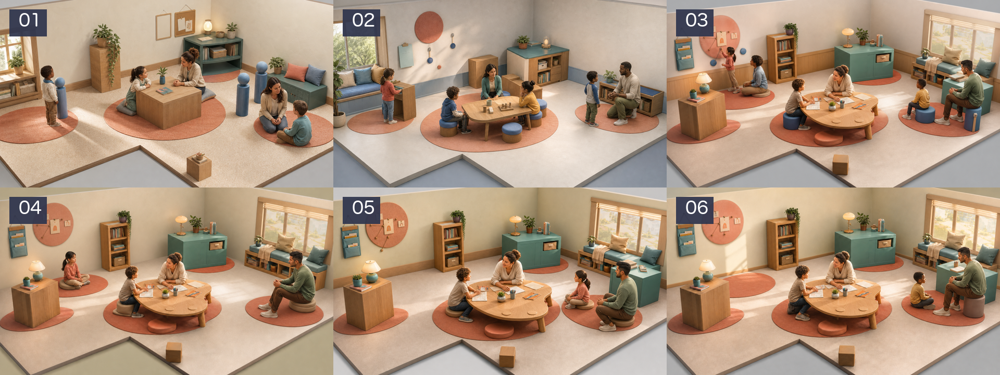

# Primary School V4 — Art Direction Discovery Gate

**Status:** waiting for user direction review

**Recommended candidate:** `05-sculpted-storybook`

**Promotion status:** blocked from final Art Gate and img2threejs

**Follow-up evidence:** a six-view room-direction packet has been prepared
from candidate 05 as a reversible provisional anchor. Review it in
[`../room/README.md`](../room/README.md); it remains pending explicit user
approval and is not promotion eligible.

This packet is the first visual checkpoint for the `primary-school-v4` pilot. It
contains six geometry-controlled hero candidates, their exact 16:9 review
crops, and the runtime-derived Blender graybox inputs that constrained them.
It is deliberately not the final Art Target Pack: no candidate is marked
`approved`, the complete room/prop/character multiview set has not been
painted over, and the required FLUX.2/Krita provenance is not fabricated.

## Player promise checked at this gate

The room must make a first-time player want to approach another person and
understand a spatial loop from reading evidence, to a shared table, to a
visible question-wall consequence. The room remains a real L-shaped,
walkable, orbitable interior; the image is a design target, never a runtime
billboard.

## Geometry authority

- Runtime source: `public/game.js`, shell `primary-school-learning-loop-v3`.
- Room: 13.5m × 10.5m × 3.9m L-shaped polygon.
- Door: 1.35m, edge 4.
- Preserved inputs: four functional zones, six prop placements, three actor
  staging points, player spawn, camera-safe area and three camera targets.
- Blender: 4.3.2, `BLENDER_EEVEE_NEXT`.
- Input-contract SHA-256:
  `b7539bfad43e181ab051c7e6131946690f00c8ecd89be0861a2663ebf561f5b6`.
- The reproducible local command is
  `npm run prepare:interior-pilot -- primary-school`.

The tracked `geometry-controls/` directory contains the hero beauty, depth,
normal and line controls plus the top view. The complete six-view × six-pass
set remains generated under `dist/interior-3d-work/primary-school-v4/`.

## Candidate decision

| ID | Result | Decision |
| --- | --- | --- |
| 01 Morning Paper Glow | Strong material warmth, but five people and three blue guide figures remain. | Reject |
| 02 Cornflower Quiet | Better central table, but six people and continuous blue wall paneling violate the contract. | Reject |
| 03 Coral Answer | Strongest first-pass composition, but seven people and forbidden wall paneling. | Reject as source; retain as edit anchor |
| 04 Four-Person Clarity | Exactly four people, clean circulation and calm negative space. | Finalist |
| 05 Sculpted Storybook | Exactly four people; strongest environment/character unity and clearest social grouping. | **Recommended** |
| 06 Golden Pause | Exactly four people and best warm/cool lighting split, but the group clusters too far right. | Finalist |

Choose 04, 05 or 06 as the direction anchor. Candidate 05 is recommended; its
remaining weakness is that the faces are still closer to stylized editorial
realism than the final authored game characters. The following character
sheets must correct this with 5.25/4.25-head proportions, continuous facial
planes, directional hair masses and production-ready clothing construction.

## Cross-review dissent

- **Player/product:** Candidates 04–06 improve approachability, but a still
  image cannot prove that the next action or its consequence is understood.
  The slow-answer card and question-wall state change remain runtime gates.
- **Game design:** A pleasant classroom can become passive set dressing. The
  final pack must keep the evidence → invitation → choice → shared action →
  consequence route spatially legible.
- **Art:** Candidate 05 is coherent, but one hero view cannot prove backsides,
  character identity or prop construction. The 42 prop and 28 character views
  remain mandatory.
- **Engineering/performance:** These images authorize shapes and materials,
  not polygon counts, draw calls or texture sizes. No runtime budget is being
  claimed at this checkpoint.
- **QA/release:** The generated images inevitably reinterpret some secondary
  furniture silhouettes. Blender and the runtime Blueprint remain authoritative;
  no image-derived geometry may silently move anchors or narrow clearances.

## Toolchain evidence and current constraint

The planned local ComfyUI path is not viable on this workstation: it is an
Intel Mac with 16GB RAM and no MPS/CUDA GPU. The local hardware check reports
CPU inference as unusably slow, while the official FLUX.2 klein 4B requirement
is approximately 8.4GB VRAM. The six discovery images therefore use the
built-in image generation tool and are marked `promotionEligible: false`.
The built-in service does not expose a checkpoint hash or editable Krita
source, so it cannot be mislabeled as the final FLUX.2/Krita Art Target.

After the user chooses the visual anchor, the final packet must use either an
authorized GPU/cloud ComfyUI execution with a real checkpoint hash plus Krita
paint-over, or an explicitly approved revision of the toolchain/specification.
No Production deployment is part of this gate.
