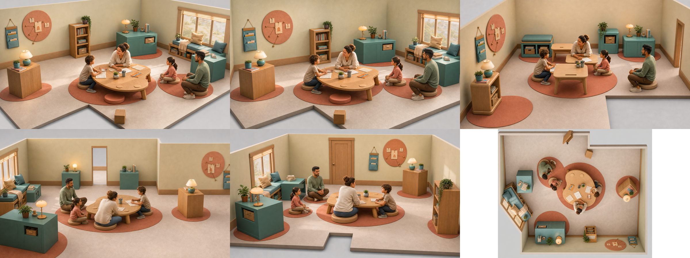

# Primary School V4 — Room Direction Packet

**Status:** technically complete, pending user art approval

This directory is the geometry-controlled room-direction checkpoint for the
`primary-school-v4` pilot. It is not the final Art Target Gate and does not
authorize img2threejs or runtime asset production.

The selected provisional anchor is discovery candidate 05, “Sculpted
Storybook”. The six images cover the hero, four yaw directions and a top view.
The runtime Blueprint remains the spatial authority: generated images may
clarify furniture construction and materials, but may not move anchors,
colliders, doors or circulation.

## What to review

- Warm storybook-cinematic tone: ivory plaster, honey oak, muted teal and
  coral textiles.
- One rounded furniture family rather than un-authored solid blocks.
- Exactly four participants and a readable shared-learning group.
- L-shaped floor, door and clear route remain visible across the yaw evidence.
- The shared table is primary; reading/storage and question furniture are
  secondary.

## Known limits

- `hero` and `yaw-0` intentionally share nearly the same presentation angle.
- These service-generated PNGs expose no model checkpoint hash or seed and
  have no editable Krita source. They are therefore marked
  `promotionEligible: false` until the user approves a revised toolchain or an
  authorized FLUX.2/Krita pass replaces them.
- Prop turntables, character sheets, detail views and benchmark composition
  are still absent; the final Art Target verifier must remain red.

Run `npm run verify:interior-pilot:room-direction` to verify file integrity and
geometry-review metadata. Add `-- --require-approved` only after the user has
explicitly approved this room direction and the review record has been updated.
